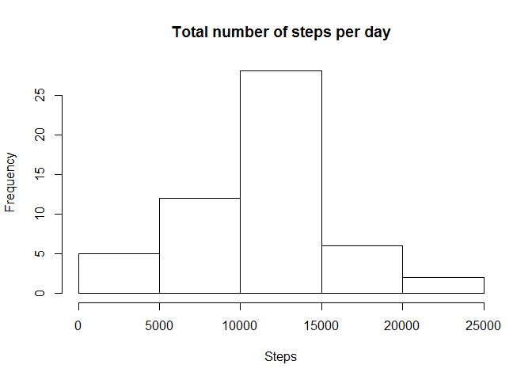

# Reproducible Research: Peer Assessment 1


## Loading and preprocessing the data
### 1. Read dataset

```r
download.file("https://d396qusza40orc.cloudfront.net/repdata%2Fdata%2Factivity.zip", "repdata%2Fdata%2Factivity.zip")
unzip("./repdata%2Fdata%2Factivity.zip")
activityData <- read.csv("./activity.csv")
str(activityData)
```

```
## 'data.frame':	17568 obs. of  3 variables:
##  $ steps   : int  NA NA NA NA NA NA NA NA NA NA ...
##  $ date    : Factor w/ 61 levels "2012-10-01","2012-10-02",..: 1 1 1 1 1 1 1 1 1 1 ...
##  $ interval: int  0 5 10 15 20 25 30 35 40 45 ...
```
<br />


## What is mean total number of steps taken per day?
### 2. Histogram of the total number of steps taken each day

####Ignore the missing values in the dataset for this part of the assignment

```r
activityDataWithoutNa <- na.omit(activityData)
```

####Calculate the total number of steps taken per day


```r
totalStepsPerDay <- aggregate(steps ~ date, activityDataWithoutNa, FUN = sum)
```

####Histogram of the total number of steps taken each day

```r
hist(totalStepsPerDay$steps, main = "Total number of steps per day", xlab = "Steps")
```

<!-- -->

###3. Mean and median number of steps taken each day

####Mean number of steps taken each day

```r
meanNumberStepsPerDay <- aggregate(steps ~ date, activityDataWithoutNa, FUN = mean)
head(meanNumberStepsPerDay)
```

```
##         date    steps
## 1 2012-10-02  0.43750
## 2 2012-10-03 39.41667
## 3 2012-10-04 42.06944
## 4 2012-10-05 46.15972
## 5 2012-10-06 53.54167
## 6 2012-10-07 38.24653
```

####Median number of steps taken each day

```r
medianNumberStepsPerDay <- aggregate(steps ~ date, activityDataWithoutNa, FUN = median)
head(medianNumberStepsPerDay)
```

```
##         date steps
## 1 2012-10-02     0
## 2 2012-10-03     0
## 3 2012-10-04     0
## 4 2012-10-05     0
## 5 2012-10-06     0
## 6 2012-10-07     0
```
<br />


## What is the average daily activity pattern?
###4. Time series plot of the average number of steps taken

####Average number of steps taken for each interval

```r
averageNumberStepsPerInterval <- aggregate(steps ~ interval, activityDataWithoutNa, FUN = mean)
```

####Time series plot (i.e. type = "l") of the 5-minute interval (x-axis) and the average number of steps taken, averaged across all days (y-axis)

```r
plot(averageNumberStepsPerInterval, type = "l", main = "Average number of steps per each 5-min interval", xlab = "5-min intervals", ylab = "Average number of steps", lwd = 2, xaxt = 'n')
axis(1, at = seq(0, 2500, 250))
```

<!-- -->

###5. The 5-minute interval that, on average, contains the maximum number of steps

####Row on average across all the days in the dataset, contains the maximum number of steps

```r
maxNumberStepsRow <- which.max(averageNumberStepsPerInterval[,"steps"])
```

####5-minute interval, on average across all the days in the dataset, contains the maximum number of steps

```r
maxNumberStepsInterval <- averageNumberStepsPerInterval[maxNumberStepsRow,"interval"]
maxNumberStepsInterval
```

```
## [1] 835
```
<br />


## Imputing missing values
###6. Code to describe and show a strategy for imputing missing data

####Calculate and report the total number of missing values in the dataset (i.e. the total number of rows with NAs)

```r
totalNumberMissingValues <- length(which(is.na(activityData) == TRUE))
totalNumberMissingValues
```

```
## [1] 2304
```

####Describe and show a strategy for imputing missing data:
Frequency of missing data for particular values of Date and Intervals can be presented using histograms.<br />
Histogram for Intervals shows that missing values has almost the same frequency for all intervals values, differently than for Date.<br />
Median for 5-minute intervals will be used to impute missing data, because it gives more balanced values of missing data (without areas with far disorted imputing values).

####Median number of steps taken for each interval

```r
medianNumberStepsPerInterval <- aggregate(steps ~ interval, activityDataWithoutNa, FUN = median)
```

####Merge original dataset with median number of steps taken for each interval according to interval columns

```r
activityDataMedianNumberStepsPerInterval <- merge(activityData, medianNumberStepsPerInterval, by = "interval")
```

####Missing data filled in by median number of steps taken for each interval

```r
rowsWithNa <- which(is.na(activityDataMedianNumberStepsPerInterval$steps.x == TRUE))
for(i in 1:length(rowsWithNa)){
  activityDataMedianNumberStepsPerInterval[rowsWithNa,"steps.x"] <- activityDataMedianNumberStepsPerInterval[rowsWithNa, "steps.y"]
}
```

####New dataset as much similar to original data set as possible

```r
names(activityDataMedianNumberStepsPerInterval)[2] <- "steps"
newDataActivity <- activityDataMedianNumberStepsPerInterval[c(2,3,1)]
newDataActivity <- newDataActivity[order(newDataActivity$date),]
row.names(newDataActivity) <- 1:length(newDataActivity$steps)
str(newDataActivity)
```

```
## 'data.frame':	17568 obs. of  3 variables:
##  $ steps   : int  0 0 0 0 0 0 0 0 0 0 ...
##  $ date    : Factor w/ 61 levels "2012-10-01","2012-10-02",..: 1 1 1 1 1 1 1 1 1 1 ...
##  $ interval: int  0 5 10 15 20 25 30 35 40 45 ...
```


###7. Histogram of the total number of steps taken each day after missing values are imputed

####Calculate the total number of steps taken per day after missing values are imputed

```r
totalStepsPerDayAfterImpute <- aggregate(steps ~ date, newDataActivity, FUN = sum)
```

####Histogram of the total number of steps taken each day

```r
hist(totalStepsPerDayAfterImpute$steps, main = "Total number of steps per day after missing values are imputed", xlab = "Steps")
```

<!-- -->
<br />


## Are there differences in activity patterns between weekdays and weekends?
###8. Panel plot comparing the average number of steps taken per 5-minute interval across weekdays and weekends

####Create a new factor variable in the dataset with two levels – “weekday” and “weekend” indicating whether a given date is a weekday or weekend day

```r
newDataActivity$date <- factor(weekdays(as.Date(newDataActivity$date)))
levels(newDataActivity$date)[c(1,3,4,6,7)] <- "weekday"
levels(newDataActivity$date)[c(2,3)] <- "weekend" 
str(newDataActivity$date)
```

```
##  Factor w/ 2 levels "weekday","weekend": 1 1 1 1 1 1 1 1 1 1 ...
```

####Make a panel plot containing a time series plot (i.e. type = "l") of the 5-minute interval (x-axis) and the average number of steps taken, averaged across all weekday days or weekend days (y-axis)

####Average number of steps taken for each interval

```r
averageNumberStepsPerIntervalAfterImpute <- aggregate(steps ~ date+interval, newDataActivity, FUN = mean)
```

####Divide above dataset according to "weekdays" and "weekends"

```r
averageNumberStepsPerIntervalWeekdays <- averageNumberStepsPerIntervalAfterImpute[averageNumberStepsPerIntervalAfterImpute$date == "weekday",]
averageNumberStepsPerIntervalWeekends <- averageNumberStepsPerIntervalAfterImpute[averageNumberStepsPerIntervalAfterImpute$date == "weekend",]
```

####Time series panel plot (i.e. type = "l") of the 5-minute interval (x-axis) and the average number of steps taken, averaged across all days (y-axis)


####First part of plot for "weekdays", second part of plot for "weekends"

```r
par(mfrow=c(2,1))
plot(averageNumberStepsPerIntervalWeekdays$interval, averageNumberStepsPerIntervalWeekdays$steps, type = "l", main = "Average number of steps per each 5-min interval in weekdays", xlab = "5-min intervals", ylab = "Average number of steps", lwd = 2, xaxt = 'n', ylim = c(0,225))
axis(1, at = seq(0, 2500, 250))

plot(averageNumberStepsPerIntervalWeekends$interval, averageNumberStepsPerIntervalWeekends$steps, type = "l", main = "Average number of steps per each 5-min interval in weekends", xlab = "5-min intervals", ylab = "Average number of steps", lwd = 2, xaxt = 'n', ylim = c(0,225))
axis(1, at = seq(0, 2500, 250))
```

<!-- -->
<br />
Yes, there are differences in activity patterns between weekdays and weekends. They are presented on above panel plot, which has the same axis scales for easier observation.
